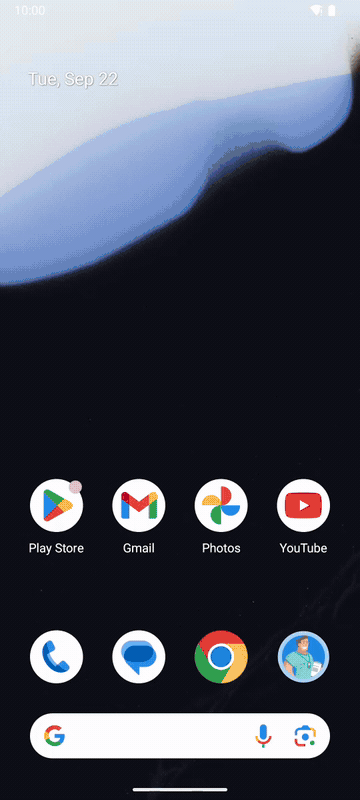
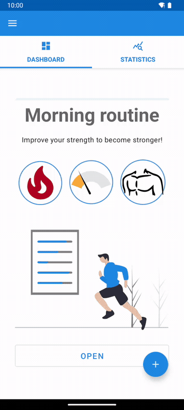
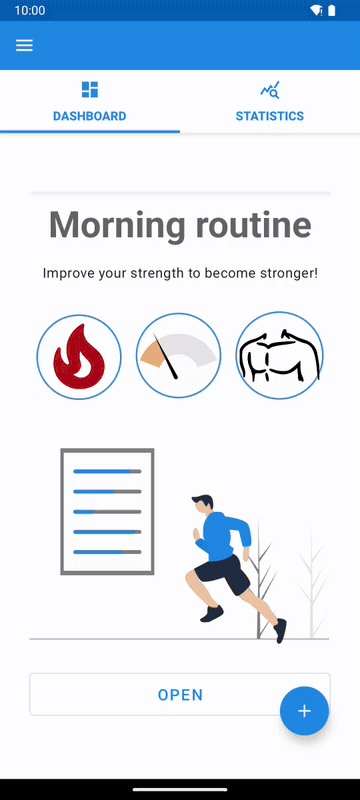

# Workout Plan

[](https://github.com/davidcohenDC/workout-plan/actions/workflows/build.yml)
[](https://github.com/davidcohenDC/workout-plan/releases/latest)
[](LICENSE)

An Android app that builds a workout from a few choices and then coaches you
through it, set by set. It was my project for the Mobile Systems Programming
course (Programmazione di Sistemi Mobile) at the University of Bologna,
2021/2022. I went past the assignment and added the part I cared about most:
running the workout, with a countdown per set, editable sets, a final report
and statistics. Everything is in Kotlin, with Room, LiveData, coroutines, the
Navigation component and Data Binding.

I keep it here as I handed it in.

## What it does

Three parts: setting up a workout, the dashboard, and the workout itself.

### Setup

<p align="center">
  
</p>

A wizard asks for a title, a category (strength, cardio or healthy), one of
four difficulties and one of five muscle groups, then shows an exercise book
ordered by how well each exercise fits those choices. You pick five to eight
exercises, filter them by muscle group, difficulty or name, and open any of
them to read its description or look it up on the web. A small engine then
turns the choices into sets, repetitions and durations for every exercise.

### Dashboard

<p align="center">
  
</p>

All the workouts with their main traits, the exercises of each one with their
sets, repetitions and durations, editable one by one, the statistics of the
sessions done so far, and the button that starts a workout. Workouts can be
deleted at any time.

### Workout

<p align="center">
  
</p>

A countdown for each set, boxes that fill in as sets complete, previous and
next exercise, pause and play, a new set added on the spot, a set not yet done
edited in repetitions or duration, and a stop button. At the end, a report
with a star rating, time, sets, repetitions and the percentage completed,
which the statistics tab keeps.

English and Italian, and layouts that adapt to any screen size.

## Run it

Download `workout-plan-<version>.apk` from the
[latest release](https://github.com/davidcohenDC/workout-plan/releases/latest)
and install it on any phone or emulator running Android 4.4 or newer:

```sh
adb install workout-plan-1.0.0.apk
```

Opening the file on the phone works too. The APK is signed with the debug key,
so Android asks you to allow the installation the first time.

## Build it

```sh
git clone https://github.com/davidcohenDC/workout-plan.git
cd workout-plan
./gradlew assembleDebug      # app/build/outputs/apk/debug/app-debug.apk
./gradlew installDebug       # install on the connected device or emulator
```

The build needs JDK 11 (Gradle 7.2 and the Android Gradle plugin 7.1 do not
run on newer ones) and the Android SDK, with `sdk.dir` in `local.properties`
or `ANDROID_HOME` set; missing SDK components are downloaded on the first
build. `scripts/build-apk.sh <version>` is what the release does: it stamps
the version into the APK and names the file after it.

## How it is organised

MVVM: fragments observe `LiveData` exposed by a ViewModel, which reads and
writes through a repository over a Room DAO. Everything lives in
`app/src/main/java/com/example/workoutplan/`.

- `data/` the Room database, entities, DAOs, relations and repositories; on
  the first start a WorkManager worker seeds it from the JSON files in
  `assets/`;
- `fragments/` and `res/navigation/` the screens and the two navigation
  graphs: `MainActivity` hosts home, workout, session and summary,
  `SetupActivity` hosts the creation wizard, which passes its state along as a
  Safe Args argument;
- `viewmodels/` one ViewModel and factory per screen, navigation driven by
  `LiveData` events;
- `adapters/` RecyclerView adapters and the `@BindingAdapter`s that map
  categories, difficulties and muscles to icons and strings;
- `utilities/` the rules that turn the wizard choices into sets, repetitions
  and durations, the session timer and a few helpers.

Material Components for the widgets, drawer and transitions, Lottie for the
animations, Glide for the images and Toasty for the toasts. The instrumented
tests in `app/src/androidTest/` cover the DAOs and the home screen.

## Since 2022

The Kotlin code is untouched. In 2026 I added this README, the demo, CI that
builds the APK and boots it on an emulator, and semantic releases that attach
the APK; I also dropped the IDE files from the repository and made the build
read the version number from the release.

## License

[MIT](LICENSE) © 2021 David Cohen
