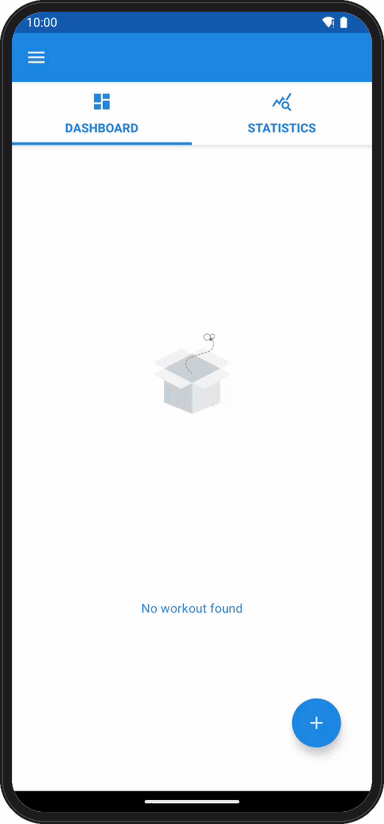
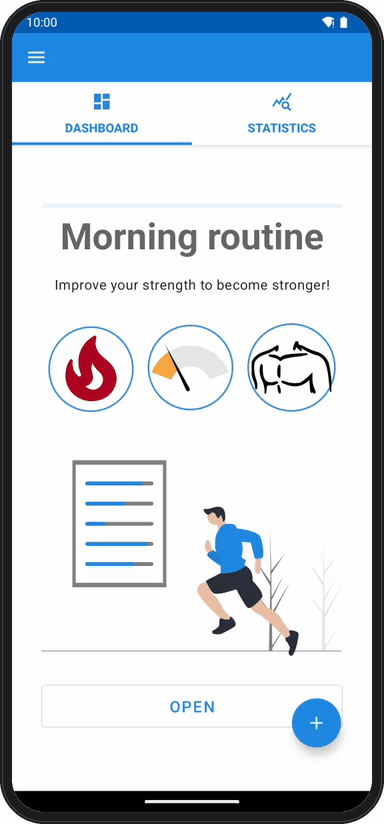

# Workout Plan

[](https://github.com/davidcohenDC/workout-plan/actions/workflows/build.yml)
[](https://github.com/davidcohenDC/workout-plan/releases/latest)
[](LICENSE)

An Android app to create a workout and follow it, set by set. I made it for
the Mobile Systems Programming course at the University of Bologna
(2021/2022). The course asked for the creation part; I went on and added the
workout session, the summary and the statistics because I wanted to use it
myself.

Kotlin, MVVM, Room, LiveData, coroutines, Navigation, Data Binding. I keep it
here as I handed it in.

## What it does

### Setup

<picture>
  <source media="(prefers-color-scheme: dark)" srcset="docs/setup-dark.gif">
  
</picture>

You give the workout a name and pick a category (strength, cardio or
healthy), one of four difficulties and one of five muscle groups. From those
choices the app builds a profile and shows you the exercise book with the
exercises that fit you best first. You pick from five to eight of them; you
can filter the list by muscle group, difficulty or name, and open each
exercise to read its description or search it on the web. When you confirm,
an engine computes sets, reps and duration for every exercise, so the
workout is ready to start.

<br clear="all">

### Dashboard

<picture>
  <source media="(prefers-color-scheme: dark)" srcset="docs/dashboard-dark.gif">
  
</picture>

All your workouts, each with its category, difficulty and muscle group. Open
one and you get its exercises with their sets, reps and duration; open an
exercise and you can read about it, change its sets and reps, or share it.
The statistics tab keeps every session you did, with time, sets, reps and
how much of it you completed. From here you can also delete a workout or
start it.

<br clear="all">

### Workout

<picture>
  <source media="(prefers-color-scheme: dark)" srcset="docs/workout-dark.gif">
  
</picture>

Every set has its own countdown and the boxes fill up as you complete them.
You can pause and resume, go to the next exercise or back to the previous
one, add a set on the spot, change the reps or the duration of a set you
still have to do, read the exercise info and stop whenever you want. At the
end you get a summary with a star rating, total time, sets, reps and the
percentage completed, and the session goes into the statistics.

<br clear="all">

The app is in English and Italian, and the layouts adapt to any screen size.

## Run it

Download `workout-plan-<version>.apk` from the
[latest release](https://github.com/davidcohenDC/workout-plan/releases/latest)
and install it on a phone or emulator with Android 4.4 or newer:

```sh
adb install workout-plan-0.0.1.apk
```

Opening the file on the phone works too. The APK is signed with the debug
key, so Android asks you to allow the installation.

## Build it

```sh
git clone https://github.com/davidcohenDC/workout-plan.git
cd workout-plan
./gradlew assembleDebug      # app/build/outputs/apk/debug/app-debug.apk
./gradlew installDebug       # install on the connected device or emulator
```

You need JDK 11 (Gradle 7.2 and the Android Gradle plugin 7.1 do not work
with newer ones) and the Android SDK, with `sdk.dir` in `local.properties`
or `ANDROID_HOME` set. What is missing from the SDK is downloaded at the
first build. `scripts/build-apk.sh <version>` is what the release uses to
build the APK with the version inside.

## How it is organised

MVVM: the fragments observe `LiveData` from a ViewModel, the ViewModel uses a
repository, the repository uses a Room DAO. All the code is in
`app/src/main/java/com/example/workoutplan/`.

- `data/` the Room database, entities, DAOs, relations and repositories. At
  the first start a WorkManager worker fills it from the JSON files in
  `assets/`;
- `fragments/` and `res/navigation/` the screens and the two navigation
  graphs: `MainActivity` has home, workout, session and summary,
  `SetupActivity` has the creation wizard, which passes its state from step
  to step with Safe Args;
- `viewmodels/` one ViewModel and one factory per screen;
- `adapters/` the RecyclerView adapters and the binding adapters that turn
  categories, difficulties and muscles into icons and text;
- `utilities/` the rules that compute sets, reps and duration from the
  choices, the session timer and some helpers.

Other libraries: Material Components, Lottie for the animations, Glide for
the images, Toasty for the toasts.

## Since 2022

The code is untouched. In 2026 I added this README, the GIFs, a CI that
builds the APK and starts it on an emulator, and releases with the APK
attached. I also removed the IDE files from the repository and made the
build take the version number from the release.

## License

All rights reserved. You can read the code and install the APK on your own
phone; for anything else, ask me first. See [LICENSE](LICENSE).
